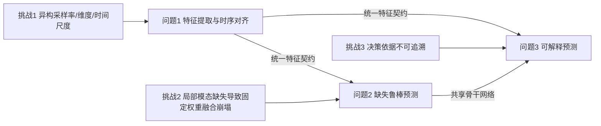
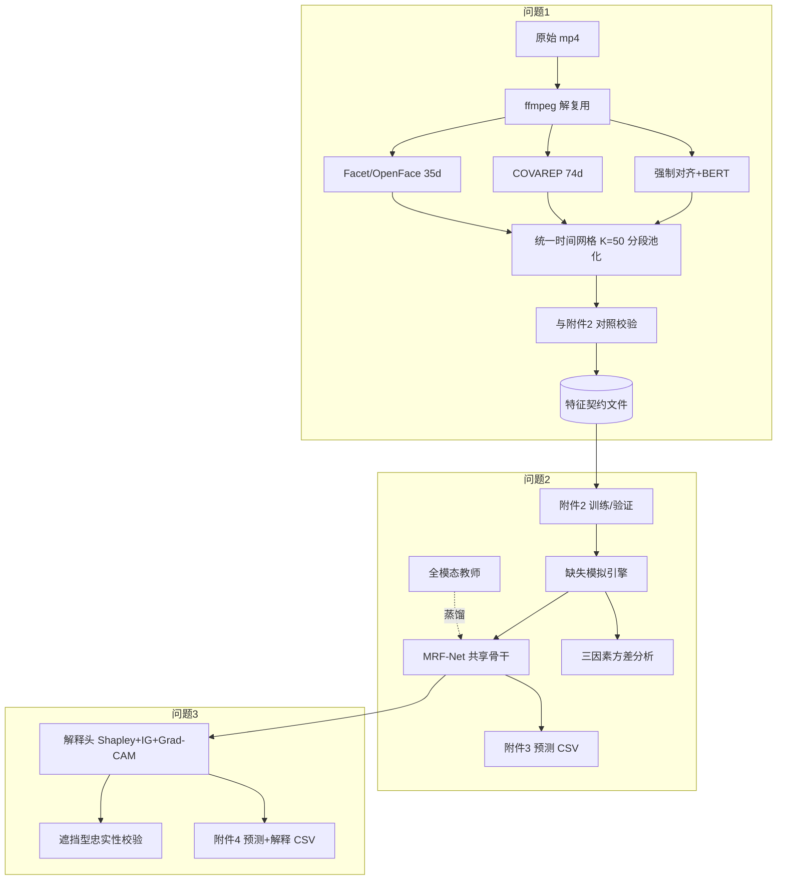

# 2026 研赛 E 题：复杂场景下多模态情感预测 — 总体方案

## 1. 题目数字化解读

| 问题 | 输入 | 输出/交付 | 评价 |
|---|---|---|---|
| 问题1 | 附件1：100 条原始视频 mp4 + `label-100.xlsx` | 自生成 100 条三模态时序特征文件 + 全量汇总表 + 典型样本对齐验证 + 可复现说明 | 覆盖完整性 / 时序可核验性 / 方法合理与可复现 |
| 问题2 | 附件2（aligned **或** unaligned，全流程统一版本）训练+验证；附件3 无标签缺失测试集 | 鲁棒模型 + 附件3 预测 CSV + 缺失因素规律分析 | 极性：Accuracy、F1；强度：MAE、Pearson |
| 问题3 | 同上 + 附件4 无标签完整测试集 + 原视频 | 可解释模型 + 附件4 预测与解释 CSV + 解释卡 | 同问题2 + 解释忠实性/稳定性 |

**三重挑战 → 三条技术主线**

**核心设计思想：先立"特征契约"，再建"共享骨干"，最后"一模型双能力"。**
问题2 与问题3 不做两个互不相干的模型，而是同一骨干网络（MRF-Net）+ 两个能力头（鲁棒融合头、解释头）。这样既省算力，又能让解释性结论直接支撑鲁棒性分析，论文内在逻辑自洽，是拿高分的关键结构。

---

## 2. 数据资产与硬约束

| 资产 | 规模 | 关键结构 | 用途 |
|---|---|---|---|
| 附件1 | 37 个 `video_id` 目录，`clip_id.mp4`；时长 2.648–34.567 s | `label-100.xlsx`：`video_id/clip_id/text/label/annotation` | 仅问题1（特征提取来源） |
| 附件2 | 各 4850 条 | `data['train'|'valid'|'test'][字段][j]`；文本 (N,50,768)、语音 (N,50,74) 或 (N,500,74)、视觉 (N,50,35) 或 (N,500,35) | 问题2、3 训练/验证/阈值选择 |
| 附件3 | 若干无标签 | 与附件2 同构，含**连续区间全零**的模态缺失 | 问题2 专项推理 |
| 附件4 | 若干无标签完整 | 同构 + 原始视频（用于证据回看） | 问题3 专项推理 |

### 硬约束（必须写进论文"数据合规性"小节）

1. **唯一数据来源**：只能使用赛题 CMU-MOSEI 系列数据；不得引入任何其他公开/私有情感数据集参与训练、微调、参数优化、阈值选择或结果统计。
2. **预训练模型可用**：BERT、WavLM、Whisper、OpenFace 等属**通用特征提取/基础模型**，非情感标注数据集，可用于问题1的"特征提取基础处理"；其冻结权重不构成"引入外部情感数据集"。此论证必须在论文中显式陈述。
3. **附件2 版本一致性**：aligned 与 unaligned **二选一**，训练/验证/专项测试全程同一版本、同一输入接口。
4. **附件1 不可改动**：极短/异常片段的处理只能以掩码、截断等**模型侧规则**实现，原始样本必须保留。
5. **匿名化**：附件中禁止出现单位、姓名、队号。

### ⚠️ 两个必须自查的"陷阱"

**陷阱 A（已实测确认，改写题目描述）：`aligned_50.pkl` 中没有 `*_lengths` 字段。**
实测附件2 的真实结构为：`train/valid/test` 三个顶层键，每个 split 的字段为
`raw_text, audio, vision, id, text_bert, classification_labels, regression_labels, text`
——**没有 `audio_lengths`、`vision_lengths`，也没有 `annotations`**（题目表2 中提到的这两个字段在本附件中不存在）。
因此**有效长度只能从"尾部连续全零"推断**（最后一个非零时间步即有效长度末位）。
必须在论文中如实说明这一处理规则，并给出推断代码与统计结果。

**实测统计（附件2 aligned 版本）**

| split | N | 文本填充率 | 语音填充率 | 视觉填充率 | 有效区间内真缺失率(text/audio/vision) |
|---|---|---|---|---|---|
| train | 3395 | 0.507 | 0.527 | 0.542 | 0.0000 / 0.0004 / 0.0103 |
| valid | 728 | 0.488 | 0.508 | 0.524 | 0.0000 / 0.0013 / 0.0114 |
| test | 727 | 0.496 | 0.516 | 0.534 | 0.0000 / 0.0000 / 0.0100 |

关键结论：① 序列约**一半位置是尾部填充**，有效长度均值仅约 24/50；
② 附件2 本身**几乎没有真缺失**（仅视觉约有 1% 的样本存在零星全零段，推测源于人脸检测失败）；
③ 极性标签取值集合为 **{0,1,2}**，分布 Neg/Neu/Pos = 967/758/1670（中性约占 22%）。
→ 结论：**问题2 的缺失场景必须在训练时通过模拟注入**（本方案已实现），
且"填充"与"缺失"必须在建模中严格区分（前者是数据格式，后者是题目定义的失效现象）。

**陷阱 B：零值判定的歧义。** 附件3 的缺失定义为"某模态某连续区间特征值**全部为零**"。
由于填充位也是零，判定规则必须限定在**有效区间内**：**有效区间内连续 ≥2 个时间步、该模态全部维度同时为零**才判为缺失，
其余零值归为尾部填充。附件3/4 推理时会输出缺失区间清单作为佐证。

---

## 3. 统一特征契约（Feature Contract）

三问之间、模型与数据之间唯一的对接标准。**问题1 产物必须与附件2 字段同名同形**，这样问题2/3 代码只需切换数据路径。

| 字段 | 形状 | 类型 | 说明 |
|---|---|---|---|
| `id` | (N,) | str | `video_id$_$clip_id` |
| `raw_text` | (N,) | str | 原始转写（核查用） |
| `text` | (N,50,768) | float32 | 文本语义特征 |
| `text_bert` | (N,3,50) | int64 | 可选，本方案统一使用 `text` |
| `audio` | (N,50,74) / (N,500,74) | float32 | 语音韵律特征 |
| `vision` | (N,50,35) / (N,500,35) | float32 | 视觉表情/动作特征 |
| `audio_lengths` / `vision_lengths` | (N,) | int | **本附件中不存在**，由"尾部全零"推断有效长度 |
| `annotations` | (N,) | str | **本附件中不存在**，极性由 `classification_labels` 给出 |
| `regression_labels` | (N,) | float | [-3,3] |
| `classification_labels` | (N,) | float64 | 取值 {0,1,2} |
| `mask_audio/mask_vision/mask_text` | (N,50) 或 (N,500) | bool | **本方案新增**：有效位（附件3/4 由零值检测生成） |

标签映射规则（严格按题）：`label ∈ [-3,0) → Negative`，`=0 → Neutral`，`(0,3] → Positive`。

---

## 4. 技术路线总览

---

## 5. 参考文献 → 方法映射（论文"相关工作"直接可用）

| 文献 | 核心思想 | 本方案落点 |
|---|---|---|
| [1] Zhang 2024 综述 | 音/视/文多模态 ER 全景 | 论文引言与相关工作骨架、基线选型依据 |
| [2] 超图条件扩散 + 不确定性 (CVPR'26) | 缺失模态重建 + 不确定性感知 | 问题2 的**超图条件重建模块**与**NLL 不确定性头**（创新点1） |
| [3] Factorize-Reconstruct-Enhance (CVPR'26) | 分解-重建-增强统一框架 | 问题2 骨干主干（共享/特有分解 + 跨模态重建） |
| [4] CMAD 相关性/模态感知蒸馏 (ICCV'25) | 全模态教师 → 缺失学生 | 问题2 **知识蒸馏正则**（创新点2，提升缺失鲁棒最有效） |
| [5] Proxy-Driven 不完备数据 (ACL'25) | 代理特征驱动鲁棒 MSA | 问题2 **可学习代理令牌**填补局部缺失 |
| [6] 因果推断的不变模态表示 (ACL'26) | 模态不变表示 | 问题2 **不变性正则** + 问题3 **跨样本稳定性分析** |
| [7] EMOE 模态特定动态专家 (CVPR'25) | 动态专家路由 | 问题2 **动态专家融合**（按模态可用性路由） |
| [8] Locate and Explain (ACL'26) | 情感原因定位与解释 | 问题3 **证据定位**（文本片段/语音时段/关键帧）输出范式 |
| [9] CaReFlow 循环自适应矫正流 (CVPR'26) | 流式融合矫正 | 问题2/3 **可选增强模块**（若时间充裕做消融加分项） |
| [10] 知识蒸馏+动态调整 (计算机学报'25) | 蒸馏权重动态调节 | 问题2 蒸馏损失权重的**动态调度**策略 |

> 论文写作建议：把 [2][3][7] 归入"融合架构"、[4][10] 归入"蒸馏鲁棒"、[5][6] 归入"不完备学习"、[8] 归入"可解释"，引用时明确说明"本文在其基础上做了 XX 适配"，避免"只列不引"。

---

## 6. 统一实验协议（问题2/3 共用，防止口径不一致）

- **数据划分**：直接使用附件2 的 `train/valid/test`，不重划分。
- **模型选择与阈值**：结构、超参、分类阈值**全部在 valid 上选**；test 只报告一次最终结果。
- **随机性**：每配置 **5 个随机种子**（42, 43, 44, 45, 46），报告 mean ± std；显著性用配对 t 检验或 Wilcoxon（p<0.05）。
- **主指标**：分类 Accuracy、Macro-F1；回归 MAE、Pearson r。补充报告 `F1-Neg/F1-Neu/F1-Pos`、`CCC`、`Acc-2/Acc-5`（与 MSA 文献可比的常用补充指标）。
- **基线**：EF-LSTM、TFN、MulT、MISA、MMIM、TFR-Net、Self-MM（MMSA 工具箱可直接跑），保证可比性。
- **缺失场景基线**：全模态直接推理（**无任何处理**，用于展示"性能急剧下降"现象）、零填充、均值填充、模态 dropout 训练、MMIM+mask。

---

## 7. 交付物总览

| 编号 | 交付物 | 位置 |
|---|---|---|
| D1 | 问题1 全量特征文件（100 样本） | `submission/features_100.pkl` |
| D2 | 问题1 汇总表 + 典型样本对齐验证 | `submission/feature_summary.csv`、`figs/align_case_*.png` |
| D3 | 附件3 预测结果 CSV | `submission/pred_att3.csv` |
| D4 | 附件4 预测 + 解释 CSV | `submission/pred_explain_att4.csv` |
| D5 | 核心代码 + 环境 + 模型权重 + 复现说明 | `code/`、`README.md`、`requirements.txt` |
| D6 | 论文（正文含全部方法、实验、图表） | `paper/` |

详细格式与工程结构见 `04_提交物与实施计划.md`。
