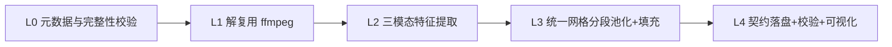

# 问题1：多模态情感特征提取与时序对齐的数学建模

## 1. 问题的数学形式化

设第 $i$ 个原始样本为 $(v_i,c_i)$，对应视频流 $V_i(t)$ 与音频流 $A_i(t)$，$t\in[0,T_i]$，$T_i\in[2.648,34.567]$ 秒。

**定义 1（模态特征提取算子）** 对模态 $m\in\{\mathrm{t},\mathrm{a},\mathrm{v}\}$，
$$\phi_m:\ \text{原始信号}\ \longrightarrow\ \mathcal{Z}_m=\{(f_j,\tau_j,w_j)\}_{j=1}^{n_m}$$
其中 $f_j\in\mathbb{R}^{d_m}$ 为第 $j$ 个基本单元的特征向量，$\tau_j$ 为其**物理时间**（词：起止区间 $[\tau^s_j,\tau^e_j]$；音频/视觉：帧中心时刻），$w_j$ 为权重。

**定义 2（统一时间网格）** 给定最大序列位置数 $K=50$（与附件2 一致），
$$t_k=\frac{k\,T_i}{K},\quad k=0,1,\dots,K,\qquad S_k=[t_{k-1},t_k)$$
段长 $\Delta=T_i/K$：2.648 s 样本为 53 ms，34.567 s 样本为 691 ms。

**定义 3（分段池化算子）** $\Pi_k:\mathcal{Z}_m\to\mathbb{R}^{d_m}$，
$$x^{(m)}_k=\frac{\sum_{j:\,\tau_j\in S_k} w_j f_j}{\sum_{j:\,\tau_j\in S_k} w_j},\qquad
w_j=\begin{cases}\tau^e_j-\tau^s_j & m=\mathrm{t}\ (\text{词时长加权})\\ 1 & m=\mathrm{a},\mathrm{v}\ (\text{等间隔帧均值})\end{cases}$$

**定义 4（标量时间归属，解决词跨越段边界）** 按最大重叠原则把每个词唯一分配到一段，避免重复计数：
$$k^\*(j)=\arg\max_{k}\ \big|\,[\tau^s_j,\tau^e_j]\cap S_k\,\big|$$

**定义 5（有效性掩码与填充）** $v^{(m)}_k=\mathbb{1}\!\left[\text{段 }S_k\text{ 内存在有效观测量}\right]$，
$$\tilde x^{(m)}_k=\begin{cases}
x^{(m)}_k & v^{(m)}_k=1\\
x^{(m)}_{k_{\text{prev}}} & v_k=0,\ \exists k'<k,\ v_{k'}=1 \quad(\text{前向填充})\\
x^{(m)}_{k_{\text{next}}} & v_k=0,\ \nexists k'<k \quad(\text{后向填充})\\
\mathbf{0} & \text{整条模态缺失}
\end{cases}$$
**填充必须同时导出 $v^{(m)}\in\{0,1\}^K$**，它是问题2/3 模型区分"真零值"与"填充零值"的唯一依据，也是本问"时序组织可核验性"的直接证据。

**最终对齐结果**：$X^{(m)}_i\in\mathbb{R}^{K\times d_m}$，$(d_\mathrm{t},d_\mathrm{a},d_\mathrm{v})=(768,74,35)$，与附件2 完全同构。

**对齐误差度量**（用于验证，而非优化目标）：
$$e_{\text{bound}}=\frac1{|\mathcal{W}|}\sum_{j}\Big(\min_k\max\big(0,\ \tau^s_j-t_k,\ t_k-\tau^e_j\big)\Big)\quad(\text{词边界到段边界距离})$$
$$e_{\text{av}}=\arg\max_{\ell}\ \mathrm{xcorr}\big(E_A(t),\ E_F(t+\ell)\big)\quad(\text{音频能量包络与面部活跃度包络的互相关滞后，理想 }\ell\approx 0)$$

---

## 2. 处理流水线（五级）



### L0 元数据与完整性校验

- 扫描 `附件1/*/video_id/clip_id.mp4`，构建清单 $\mathcal{C}=\{(v,c)\}$，与 `label-100.xlsx` 做**双向差集**，输出 `missing_in_fs`、`missing_in_xlsx`、`duplicated`。
- 用 `ffprobe` 记录每条视频的**原始时长、帧率、音轨采样率、通道数、编码格式**（写入汇总表，是"原始有效时长"列的数据来源）。
- 断言：$|\mathcal{C}|=100$ 且与 xlsx 一一对应；不满足则终止并在报告中说明。

### L1 解复用

```bash
ffmpeg -i clip.mp4 -vn -ac 1 -ar 16000 -c:a pcm_s16le audio.wav -y
ffmpeg -i clip.mp4 -q:v 2 -start_number 0 frames/%06d.jpg -y   # 保留原始帧率，供人脸/视觉提取
```

### L2 三模态特征提取（与附件2 维度对齐的策略）

| 模态 | 主方案（**对齐附件2 维度**） | 备选/增强（时间充裕时做，用于消融） | 版本标注要点 |
|---|---|---|---|
| 文本 | **强制对齐** + 冻结 BERT | RoBERTa-large、DeBERTa-v3 | 词时间戳来源、模型名称、层号（取最后 4 层均值） |
| | ① `text` 列原文**不做 ASR**，避免转写偏差；② WhisperX / torchaudio forced-align / MFA 得到词级时间戳 $[\tau^s_j,\tau^e_j]$ | | |
| | ③ 冻结 `bert-base-uncased`，逐词取 subword 隐状态均值 → $f_j\in\mathbb{R}^{768}$ | | |
| 语音 | **COVAREP（74 维）** —— 附件2 的 74 维即 COVAREP 特征集，**这是保证同构的关键** | openSMILE eGeMAPSv02（88 维）、WavLM/HuBERT 帧级 + 线性投影到 74 维 | 帧移（10 ms）、版本号、是否含 F0/NAQ/VUV |
| 视觉 | **Facet/OpenFace 2.2 → 35 维**（20 AU 强度 + 5 表情/头姿为主） | MediaPipe FaceMesh 关键点 + 统计量、DINOv2 帧特征 + PCA 到 35 维 | 抽帧率、人脸检测失败帧数、AU 模型版本 |

> **策略说明（论文必写）**：主方案刻意把三个模态压到附件2 的 (768,74,35) 维度，是为了保证**问题1 产物与附件2 可直接混合训练、可直接用于问题2/3 的同一输入接口**（题目明确要求"保持同一特征版本和同一输入接口"）。维度更高的增强特征只作为"单模态特征质量对比实验"，不改变主接口。

**各模态提取要点**
- 文本：短样本可能只有 1–3 个词，强制对齐需给足上下文；若对齐失败，退化为**按字符数等分时长**（记录 fallback 标记）。
- 语音：静音段仍有 COVAREP 输出，无需剔除；但需记录 VAD 结果作为"有效语音占比"。
- 视觉：无人脸帧 → $v_k=0$，走前向/后向填充；记录每条样本的人脸检测成功率。

### L3 分段池化与填充

严格按第 1 节定义 3–5 实现，逐样本输出 `(X_t, X_a, X_v, v_t, v_a, v_v)`。
**边界一致性**：段边界与词边界对齐时，采用左闭右开 $[t_{k-1},t_k)$，保证 $\cup S_k=[0,T]$ 且互不相交，避免位置重复。

### L4 契约落盘与校验

产物目录：

```
features/
  features_100.pkl        # dict: text/audio/vision/id/raw_text/lengths/masks/labels
  features_100.npz        # 同内容，float16 压缩版（控制附件体积）
  feature_summary.csv     # 全量汇总表（题目明确要求）
  missing_region_report.csv  # 人脸失败段/对齐失败段/填充段清单
  logs/extract_YYYYMMDD.log
```

`feature_summary.csv` 列（**直接对应题目"关键信息"要求**）：

| sample_id | video_id | clip_id | raw_duration_s | valid_duration_s | text_tool/ver | audio_tool/ver | vision_tool/ver | text_shape | audio_shape | vision_shape | align_granularity_s | valid_segments | padded_segments | face_detect_rate | md5(mp4) |
|---|---|---|---|---|---|---|---|---|---|---|---|---|---|---|---|

---

## 3. 时序可核验性：三重验证（本问最大的得分点）

**验证一：与附件2 对照（最强证据）**
附件1 的 100 条与附件2 存在 id 重合样本时，对同一条样本比较自生成特征与附件2 特征：

$$S_{\cos}=\frac{1}{N}\sum_i \cos\big(\mathrm{vec}(X^{(m)}_i),\ \mathrm{vec}(\hat X^{(m)}_i)\big),\qquad
\mathrm{MAE}=\frac1N\sum_i \frac{\|X^{(m)}_i-\hat X^{(m)}_i\|_1}{K d_m}$$

若主方案工具与原始流程一致，文本余弦相似度应显著偏高（>0.8）。**若不高，说明工具链不同，此时必须在论文中如实说明并给出"同构性论证"（维度一致、时间网格一致、统计分布一致）**。列出重合样本数、指标均值、失败案例及归因。

**验证二：跨模态一致性**
- 音频能量包络 vs 视觉面部活跃度（AU 强度总量）的互相关滞后 $e_{\text{av}}\approx0$；
- 文本词数 vs 语音有效占比的合理性检查（词密度异常样本人工抽查）。

**验证三：端到端一致性**
用自生成的 100 条特征训练一个小模型，与用附件2 特征训练的同结构模型比较验证集指标，差距在合理范围内即说明管线无系统性错误。

---

## 4. 典型样本验证（题目要求"至少 1 个"）

选 **1 个短样本 + 1 个长样本**（如最短 2.648 s 与最长 34.567 s），输出：

1. **对齐甘特图**：横轴时间（秒），三行分别为文本词、语音帧段、视觉帧段，叠加 50 个段边界竖线，词按其 $[\tau^s,\tau^e]$ 画条，颜色表示归属段号。
2. **逐段对照表**（CSV + 论文表格）：

| 段 k | 时间区间 [s] | 文本片段（词） | 语音帧区间 | 视觉帧区间 | $\|x^{(t)}_k\|_2$ | $\|x^{(a)}_k\|_2$ | $\|x^{(v)}_k\|_2$ | $v^{(m)}_k$ |
|---|---|---|---|---|---|---|---|---|

3. **热力图**：三模态 (50, d) 特征矩阵的标准化热力图（上：文本 768 维降采样；中：语音 74 维；下：视觉 35 维），可直观看出时间对齐与情绪变化同步性。
4. **标签对照**：把 `label` 与 `annotation` 标在同一时间轴上，展示情感强度与三模态特征激活的对应关系。

---

## 5. 可复现性说明模板

| 项 | 内容 |
|---|---|
| 环境 | Python 3.10.x、PyTorch 2.x、ffmpeg 6.x、openSMILE 3.0、COVAREP 1.4.2（或等价）、OpenFace 2.2.0 / Facet、WhisperX 3.x、transformers 4.4x |
| 硬件 | GPU 型号/显存、CUDA/cuDNN 版本；CPU 提取耗时统计 |
| 随机性 | 全局种子 42；BERT 冻结（无随机性）；人脸检测确定性开关 |
| 关键参数 | 音频 16 kHz 单声道、帧移 10 ms；抽帧保留原帧率；$K=50$；填充策略=前向→后向→零 |
| 运行流程 | `01_check_meta.py → 02_demux.sh → 03_text_feat.py → 04_audio_feat.py → 05_vision_feat.py → 06_align.py → 07_verify.py → 08_report.py` |
| 耗时 | 全量 100 条：解复用 ~2 min，文本对齐 ~15 min，语音 ~20 min，视觉 ~60 min（GPU/CPU 差异大，按实测填） |
| 失败重试 | 每条样本独立可重跑；失败样本清单与原因（损坏文件、无人脸、对齐失败）单独列出 |

---

## 6. 常见失分点自查

- [ ] 是否逐条给出**样本编号 ↔ 模态文件 ↔ 输出特征**的一一对应关系（题目第一项要求）？
- [ ] 是否明确给出**序列位置、有效长度、填充规则**及其与原始素材的对应记录（第二项要求）？
- [ ] 是否给出**工具版本 + 关键参数 + 处理日志 + 复现步骤**（第三项要求）？
- [ ] 是否保留了原始样本（只做掩码/截断，不删改）？
- [ ] 是否说明了极短片段（2.648 s，段长仅 53 ms）的处理规则？
- [ ] 全量 100 条特征是否**随附件提交**（注意总体积 ≤50 MB，用 float16 + npz 压缩）？
