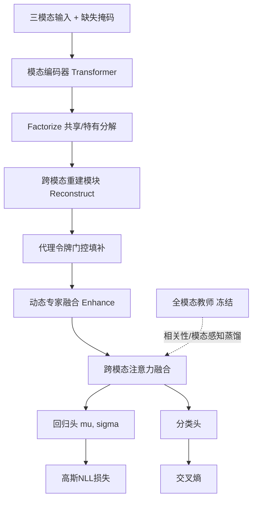

# 问题2：模态信息缺失条件下的情感预测建模与验证

## 1. 问题的数学刻画

样本 $X=(X^{t},X^{a},X^{v})$，$X^m\in\mathbb{R}^{K\times d_m}$。缺失由掩码矩阵刻画：
$$M^m_{k}=\mathbb{1}\big[\text{模态 }m\text{ 的第 }k\text{ 段不可用}\big],\qquad
\tilde X^m=X^m\odot(\mathbf{1}-M^m)$$

题目限定缺失形态为**随机连续区间**：$M^m_{k}=1\ \forall k\in[a,b]$。定义缺失率
$$\rho_m=\frac1K\sum_k M^m_k,\qquad \rho_{\text{total}}=\frac{1}{3}\sum_m \rho_m$$

**建模目标**：学习 $f_\theta:(\tilde X, M)\to(\hat y\in\mathbb{R},\ \hat p\in\Delta^2)$，使
$$\max_\theta\ \mathbb{E}_{M\sim\mathcal{D}_{\text{miss}}}\big[\text{Acc/F1}(\hat p,p)+\text{Corr}(\hat y,y)\big]-\text{MAE}(\hat y,y)$$
即在**任意**缺失模式分布下最小化性能退化。核心难点：训练时只能见到有限缺失模式，测试时的缺失模式未知（分布外泛化）。

**关键洞察**：附件3 的缺失是"特征置零"，但零值本身**携带不了任何信息**；模型必须同时利用 ①有效性指示 $M$ ②可见模态的跨模态重建 ③先验代理特征。这三者构成本方案的三条腿。

---

## 2. 缺失模拟引擎（训练数据构造）

```python
def simulate_missing(X, p, mode='random_contiguous'):
    """X:(K,d) 返回 X_missed(K,d) 与 mask(K,)  1=缺失"""
    K = X.shape[0]; mask = np.zeros(K, dtype=np.float32)
    if p <= 0: return X.copy(), mask
    L = max(1, int(round(p * K)))          # 缺失段长
    if mode == 'random_contiguous':
        s = np.random.randint(0, K - L + 1)
    elif mode == 'head':   s = 0
    elif mode == 'tail':   s = K - L
    elif mode == 'middle': s = max(0, (K - L) // 2)
    mask[s:s+L] = 1.0
    Xm = X * (1 - mask)[:, None]
    return Xm, mask
```

**训练时缺失模式采样策略（三阶段课程）**
1. 阶段一（epoch 1–10）：$\rho\sim U(0,0.2)$，仅单模态缺失 → 学会基本填补。
2. 阶段二（epoch 11–25）：$\rho\sim U(0.1,0.4)$，单/双模态混合 → 增强泛化。
3. 阶段三（epoch 26–）：$\rho\sim U(0.2,0.5)$，位置覆盖 首/中/尾/随机 → 逼近极限条件。

> 训练**始终以全模态特征为输入**，仅在特征层注入缺失掩码，标签不变；测试时缺失由数据自身零值检测得到。这保证了训练/测试口径一致。

---

## 3. 模型：MRF-Net（Missing-Robust Fusion Network）



### 3.1 掩码感知编码（Mask-aware Encoding）

$$z^m_k=\big[\,X^m_k\odot(1-M^m_k)\ \big\|\ \phi_m(M^m_k)\ \big]\in\mathbb{R}^{d_m+4}$$
$\phi_m$ 为掩码嵌入（缺失/可见 + 段位置）。含义：**让模型显式知道自己哪一段是瞎的**，这是最简单却最有效的鲁棒性来源（消融必做）。

编码器 $E_m$：`Conv1d(k=5, stride=1, pad=2) → GELU → Conv1d(k=3)` 捕捉局部动态，接正弦位置编码 + 2 层 Transformer Encoder（4 头，$d=128$，pre-LN，dropout 0.1），输出 $H^m\in\mathbb{R}^{K\times d}$，无效位置由 attention mask 屏蔽。

### 3.2 分解（Factorize，对应文献[3]）

对每模态用两个投影头：
$$H^m_{\text{share}}=P^m_s(H^m),\qquad H^m_{\text{spec}}=P^m_p(H^m)$$

- **相似性损失**（拉近共享表示）：$\mathcal{L}_{sim}=\sum_{m\neq m'}\big\|H^m_{\text{share}}-H^{m'}_{\text{share}}\big\|_2^2$
- **正交损失**（推开特有表示）：$\mathcal{L}_{diff}=\sum_m\big\|(H^m_{\text{share}})^\top H^m_{\text{spec}}\big\|_F^2$
- **重构损失**（共享+特有可还原原特征）：$\mathcal{L}_{rec0}=\sum_m\big\|X^m-D_m([H^m_{\text{share}}\|H^m_{\text{spec}}])\big\|_1$（**只在可见位置计算**）

### 3.3 重建（Reconstruct）：缺失位置靠"造"而非"填零"

设可见模态集合 $\mathcal{O}=\{m:\rho_m<1\}$。注意力式重建器：
$$\hat H^{m}=H^m+\mathrm{MHA}\big(Q=H^m,\ KV=\textstyle\bigcup_{m'\in\mathcal{O}}H^{m'}\big)\odot M^m$$

**重建损失（只对缺失位置计算，核心监督信号）：**
$$\mathcal{L}_{rec}=\sum_m \frac{\sum_k M^m_k\big\|D_m(\hat H^m)_k-X^m_k\big\|_1}{\sum_k M^m_k+\epsilon}$$

即"用你能看到的东西，把看不到的位置还原回原样"。$X^m_k$ 在训练时始终可得，因此这是**自监督、无额外数据**的填补监督。

### 3.4 代理令牌门控（Proxy，对应文献[5]）

当某模态整条缺失（$\rho_m=1$）或重建置信度低时，退回到可学习代理：
$$\tilde H^m=(1-\beta)\hat H^m+\beta\,\mathbf{p}_m\mathbf{1}^\top,\qquad
\beta=\sigma\big(w^\top[\mathrm{mean}(\hat H^m)\|\rho_m]\big)$$
$\mathbf{p}_m\in\mathbb{R}^d$ 为模态先验代理（可解释为该模态在训练集上的"平均情感表达"）。

### 3.5 动态专家融合（Enhance，对应文献[7]）

$$g=\mathrm{softmax}\big(W_g[\text{CLS}\|\rho_t\|\rho_a\|\rho_v\|\mathbb{1}_{|\mathcal{O}|=1}\|\mathbb{1}_{=2}]\big),\qquad
z=\sum_{j=1}^{N_e}g_j\,\mathrm{Expert}_j\big(\{\tilde H^m\}\big)$$
$N_e=4$（专家数），每个专家 = 一层跨模态注意力（时间维自注意力 + 模态维交叉注意力）+ FFN。缺失结构不同 → 路由到不同专家，避免"为全模态训练的权重"污染缺失样本。

可加**负载均衡损失**防专家坍缩：$\mathcal{L}_{bal}=N_e\sum_j \bar g_j\log(N_e\bar g_j)$。

### 3.6 输出头与不确定性（对应文献[2]）

$$\mu=f_\mu(z),\qquad s=f_s(z),\qquad \sigma^2=\mathrm{softplus}(s)+\sigma_0^2$$
回归用高斯负对数似然：$\mathcal{L}_{reg}=\frac12\sum_i\big[\log\sigma_i^2+\frac{(y_i-\mu_i)^2}{\sigma_i^2}\big]$
分类头输出 3 类 logits，$\mathcal{L}_{cls}=\mathrm{CE}(p,\hat p)$（可选：用 $\sigma$ 对样本加权，难样本降权）。
推理时**同时在全部 5 个种子上取 logits 均值**作为最终 $\hat y$，方差作为置信度输出（附件3 CSV 可附 `confidence` 列）。

### 3.7 知识蒸馏（对应文献[4][10]，本问最强增益点）

- 教师 $T$：全模态训练好的同结构模型（冻结，验证集 MAE 最优 checkpoint）。
- 学生 $S$：带缺失的模型。

$$\mathcal{L}_{kd}=\underbrace{\tau^2\mathrm{KL}\big(\sigma(z_T/\tau)\|\sigma(z_S/\tau)\big)}_{\text{logit 蒸馏}}
+\underbrace{\mathrm{MSE}(\mu_T,\mu_S)}_{\text{回归蒸馏}}
+\underbrace{\tau^2\mathrm{KL}\big(\mathrm{softmax}(G_T/\tau)\|\mathrm{softmax}(G_S/\tau)\big)}_{\text{关系蒸馏(样本间相似度矩阵，CMAD 的相关性感知)}}$$

**动态权重（文献[10] 的动态调整机制）：** 蒸馏权重随训练衰减，后期转向任务损失：
$$\lambda_{kd}(e)=\lambda_{kd}^{0}\cdot\exp(-e/E_{kd}),\qquad E_{kd}=20$$

### 3.8 总目标函数

$$\boxed{\ \mathcal{L}=\mathcal{L}_{reg}+\lambda_c\mathcal{L}_{cls}+\lambda_r\mathcal{L}_{rec}+\lambda_p\mathcal{L}_{rec0}+\lambda_s\mathcal{L}_{sim}+\lambda_d\mathcal{L}_{diff}+\lambda_b\mathcal{L}_{bal}+\lambda_{kd}(e)\mathcal{L}_{kd}\ }$$

**建议初始权重**（在 valid 上做网格搜索微调）：
$\lambda_c=1,\ \lambda_r=1,\ \lambda_p=0.5,\ \lambda_s=0.5,\ \lambda_d=0.5,\ \lambda_b=0.01,\ \lambda_{kd}^0=1.0$。

### 3.9 训练方案

| 项 | 设置 |
|---|---|
| 优化器 | AdamW，$\beta=(0.9,0.999)$，weight decay $10^{-4}$ |
| 学习率 | 骨干 $10^{-4}$，输出头 $10^{-3}$；cosine + 5 epoch warmup |
| 批大小 | 32（显存允许 64） |
| 轮数 | 50，早停 patience=8（监控 valid MAE） |
| 梯度裁剪 | 范数 1.0 |
| 增强 | 时间随机裁剪(保留 ≥70% 长度)、时间抖动、特征高斯噪声 $\sigma=0.01$、训练期随机时间步 dropout |
| 分类阈值 | 在 valid 上按 Macro-F1 选择（题目要求"决策阈值在验证集选"） |
| 实现 | PyTorch 2.x；单卡即可（参数量建议 < 5 M，训练 < 1 h） |

---

## 4. 缺失因素规律分析（题目明确要求 + 数学建模加分项）

### 4.1 三因素全因子/正交实验设计

| 因素 | 水平 |
|---|---|
| A 缺失类型 | 仅文本 / 仅语音 / 仅视觉 / 文本+语音 / 文本+视觉 / 语音+视觉 |
| B 缺失位置 | 开头 / 中间 / 结尾 / 随机 |
| C 缺失率 $\rho$ | 10% / 20% / 30% / 40% / 50%（对应段长 $\lceil\rho K\rceil$） |

每组合 5 个种子，得到性能矩阵 $Y_{ijln}$（$Y$ 取 MAE 或 F1）。

### 4.2 方差分析模型

$$Y_{ijln}=\mu+\alpha_i+\beta_j+\gamma_l+(\alpha\beta)_{ij}+(\alpha\gamma)_{il}+(\beta\gamma)_{jl}+\varepsilon_{ijln}$$

报告 Type-III ANOVA 的 $F$ 值、$p$ 值、偏 $\eta^2$ 效应量，**定量给出"哪个因素对性能影响最大、哪些交互显著"**——这是把"规律分析"从画曲线提升到统计推断的关键，评审非常吃这一套。

### 4.3 退化曲线拟合

对固定缺失类型，拟合"性能退化 vs 缺失率"：
$$\Delta \mathrm{MAE}(\rho)=a\rho+b\rho^2+c\rho^3+\varepsilon$$
比较不同模态的系数 $a$（线性敏感度）与 $b$（非线性放大项），并用 $R^2$ 报告拟合优度。若 $b>0$ 显著，说明"多模态缺失存在超加性损失"。

### 4.4 预期规律（假设 + 验证）

| 假设 | 依据 | 验证方式 |
|---|---|---|
| H1：文本缺失退化最严重 | MOSEI 上文本是主导模态 | 单模态缺失对比柱状图 |
| H2：视觉缺失退化最轻 | 视觉与情感强度相关性较弱 | 同上 |
| H3：中间缺失 > 首尾缺失 | 中段通常含情感峰值 | 位置因素 ANOVA 主效应 |
| H4：双模态缺失的超加性 | 跨模态重建失去可用参照 | 交互项 $(\alpha\gamma)$ 显著性与 $b$ 系数 |
| H5：时序长度越长，同等 $\rho$ 退化越小 | 段数不变但段内信息冗余更高 | 按样本时长分层统计 |

**反直觉结论也要写**：若 H3 不成立（例如首段常含情绪爆发点），如实报告并给出机理解释，比强行"符合直觉"更有价值。

### 4.5 消融实验（必做）

| 编号 | 配置 | 目的 |
|---|---|---|
| A0 | 全模态直接推理（无任何处理） | 复现"性能急剧下降"现象，作为下界 |
| A1 | 零填充 + 基础融合（MulT/MMIM） | 常用做法的基线 |
| A2 | + 掩码指示 | 掩码感知的增益 |
| A3 | + 重建损失 $\mathcal{L}_{rec}$ | 重建的增益 |
| A4 | + 分解 $\mathcal{L}_{sim},\mathcal{L}_{diff}$ | 分解的增益 |
| A5 | + 代理令牌 | 代理的增益 |
| A6 | + 动态专家 | 增强的增益 |
| A7 | + 蒸馏 | 蒸馏的增益（预期最大） |
| A8 | + 不确定性 NLL | 不确定性的增益 |
| A9 | 完整 MRF-Net | — |

同时对课程学习、$\lambda_{kd}$ 恒定 vs 动态做敏感性分析。

---

## 5. 附件3 推理与结果提交

```python
# 推理流程
# 1) 载入与训练时同一版本的 pkl（aligned 或 unaligned，二者不可混用）
# 2) 缺失检测：连续 >=2 步且该模态全维度为零 -> mask=1
# 3) 前向 -> 5 seed 集成 -> 分类阈值（valid 上选定的）-> 极性/强度
# 4) 输出 CSV
```

缺失检测与统计输出（同时作为解释性附录）：
`id, missing_audio_ratio, missing_vision_ratio, missing_text_ratio, missing_regions(JSON [[start,end],...]), n_missing_intervals`

**`pred_att3.csv` 建议列**：

| id | pred_label | pred_score | prob_neg | prob_neu | prob_pos | confidence | main_modality | n_missing_intervals |
|---|---|---|---|---|---|---|---|---|

- `pred_label ∈ {Negative, Neutral, Positive}`，由阈值化后的强度或分类头 argmax 得到（**需与论文中说明的映射规则一致**：$\hat y<-0.5\to$ Negative，$\hat y>0.5\to$ Positive，否则 Neutral；阈值在 valid 上按 Macro-F1 选）。
- `pred_score ∈ [-3,3]` 保留 4 位小数；`prob_*` 保留 4 位。
- **行数、id 顺序必须与附件3 完全一致**，附 `pred_att3_full.csv`（含缺失统计）与 `pred_att3_summary.csv`（极性分布、强度直方图统计）。

**结果展示（论文）**：极性分布饼图（与训练集分布对比是否漂移）、强度直方图、缺失率 vs 置信度散点、典型缺失样本的时间轴与预测可视化。

---

## 6. 验证集性能评价与错误归因

- **基础性能**：valid/test 上报告全模态与各缺失配置下的 ACC/Macro-F1/MAE/Pearson。
- **可视化**：混淆矩阵、MAE 分布箱线图、预测-真值散点（含 $R^2$ 与回归线）、PR/ROC（One-vs-Rest）。
- **错误归因**（分层统计，给出可验证结论）：
  1. 按真值强度分层：$|y|\approx0$（中性附近）样本错误率是否最高？（中性二义性效应）
  2. 按文本长度分层：极短文本（1–3 词）是否更依赖语音/视觉？
  3. 按缺失模式分层：哪种缺失组合错误率最高？
  4. 按人脸检测失败率分层：视觉质量是否影响强度回归？
  5. 人工抽查 top-20 高误差样本，归纳 3–5 类失败模式并各配一个案例（表格：id / 真值 / 预测 / 缺失情况 / 可能原因）。

---

## 7. 与题干的逐条对应（交付自查）

- [ ] 鲁棒模型建模原理、网络结构、目标函数、训练方案与关键参数 → 第 3 节
- [ ] 缺失类型、缺失率影响规律 + 消融实验 → 第 4 节
- [ ] 附件3 全量预测结果汇总与展示 → 第 5 节
- [ ] 验证集基础性能评价、可视化、错误归因 → 第 6 节
- [ ] 训练/验证/专项测试保持同一特征版本与同一输入接口 → 第 1、5 节

---

## 8. 已实现代码对照（`code/02_model/`）

| 本文档章节 | 实现文件 | 说明 |
|---|---|---|
| 第 1 节 缺失刻画 | `data_utils.detect_missing_mask / missing_regions` | 按"连续 ≥2 步全零"判定缺失并输出区间清单 |
| 第 2 节 缺失模拟引擎 | `missing_sim.inject_missing` | 类型×位置×率三因素注入；保留 15% 全模态样本防遗忘 |
| 第 2 节 课程学习 | `train.curriculum` + `config.curric` | 三阶段缺失率 0→0.5 |
| 3.1 掩码感知编码 | `model.ModalityEncoder` | 特征与 `miss`/`1-miss` 指示位拼接 |
| 3.2 分解 | `model.share/spec/mix` + `losses.sim_loss/diff_loss` | 共享表示 MSE + 余弦正交 |
| 3.3 重建 | `model.forward` 第 1 步 + `losses.recon_loss` | 仅缺失位置算 L1（自监督） |
| 3.4 代理令牌 | `model.forward` 第 3 步（`beta` 门控） | 可学习模态先验 |
| 3.5 动态专家 | `model.Expert` + `gate` + `losses.balance_loss` | MoE + 熵负载均衡 |
| 3.6 不确定性 | `head_mu/head_lv` + `losses.reg_nll` | 高斯 NLL |
| 3.7 蒸馏 | `losses.total_loss`（`teacher_out` 分支） | logit + 回归 + 关系蒸馏，权重指数衰减 |
| 3.9 训练方案 | `train.run_epoch / run_experiment` | AdamW + cosine + 早停 + 梯度裁剪 |
| 第 4 节 规律分析 | `missing_sim.make_scenario_masks` + `train`（`--sweep 1`） | 直接产出 ANOVA 所需数据表，含 aware/unaware 对照列 |
| 第 5 节 附件3 推理 | `infer_att3.py` | 多 ckpt 集成 + 阈值 + CSV（含缺失区间） |
| 第 6 节 指标 | `losses.compute_metrics / tune_threshold` | MAE/Pearson/CCC/ACC/Macro-F1 + valid 阈值搜索 |

运行方式见 `code/README.md`。

